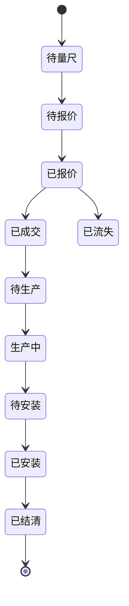

# WindoorOS 门窗量尺算料报价系统产品需求文档

版本：v1.0  
日期：2026-05-27  
目标用户：门窗加工店老板、量尺师傅、下料师傅、报价员、安装负责人

## 1. 产品定位

WindoorOS 是一套给中小门窗门店使用的移动量尺、门窗绘制、材料算量、切割优化、报价与生产排单系统。

它解决的不是单点画图问题，而是把门窗小老板日常工作里的几个断点连起来：

现场量尺靠纸笔、效果图靠口头描述、材料尺寸靠经验估算、下料靠师傅手算、报价靠 Excel 或脑算、客户订单靠聊天记录保存。

系统目标是形成完整闭环：

```text
客户登记 -> 现场量尺 -> 门窗绘制 -> 尺寸明细 -> 材料算量 -> 切割方案 -> 报价单 -> 生产排单 -> 安装回款
```

## 2. 用户画像

### 2.1 门窗小老板

特点：

- 有门店或小作坊，接本地新房、农村自建房、旧窗改造订单。
- 熟悉门窗行业，但不一定熟悉复杂软件。
- 需要快速给客户看效果、报价、安排生产。
- 最关心：少算错、少浪费、报价快、客户信任、工人看得懂。

核心诉求：

- 手机到现场能记录尺寸。
- 电脑回店能细化报价和下料。
- 客户问价格时能快速出单。
- 材料采购尽量省钱、省料、省时间。

### 2.2 量尺师傅

核心诉求：

- 手机操作简单。
- 每个窗户的位置、楼层、朝向、尺寸、备注能记清楚。
- 能拍现场照片。
- 能快速复制相同尺寸窗户。

### 2.3 下料师傅

核心诉求：

- 拿到清晰的每根料怎么切。
- 知道锯缝厚度。
- 知道每种型材要拿多少根。
- 方案要符合实际切割习惯。

### 2.4 报价员

核心诉求：

- 快速生成客户能看懂的报价单。
- 材料成本、人工、损耗、利润透明可调。
- 支持导出 PDF、图片或打印。

## 3. 核心业务概念

### 3.1 客户

客户是订单归属主体，包含：

- 姓名
- 电话
- 地址
- 微信备注
- 来源渠道
- 需求备注
- 创建时间
- 最近跟进时间

### 3.2 项目/订单

一个客户可以有多个订单，例如一期先做一楼，后续再做二楼。

订单包含：

- 订单编号
- 客户
- 状态
- 量尺日期
- 预计生产日期
- 预计安装日期
- 报价金额
- 定金
- 尾款
- 备注

### 3.3 窗户/门窗单元

一个订单包含多个门窗单元。

字段：

- 名称：一楼前窗、二楼卧室、厨房窗等
- 楼层：一楼、二楼、三楼、地下室、其他
- 朝向/位置：前、后、左、右、东、西、南、北
- 外框宽度 mm
- 外框高度 mm
- 数量
- 窗型：固定、平开、推拉、上悬、内倒、组合窗等
- 分格结构
- 中梃信息
- 玻璃信息
- 纱窗信息
- 五金配置
- 备注
- 现场照片

### 3.4 中梃/中挺

中梃是门窗内部用于分隔或承力的型材。系统统一使用字段名 `mullion`，中文显示为“中梃”。

类型：

- 竖中梃
- 横中梃
- 加强中梃
- 转角料/拼接料
- 假中梃

尺寸属性：

- 起点坐标
- 终点坐标
- 方向
- 中心线位置
- 型材系列
- 扣减规则
- 数量

### 3.5 玻璃

玻璃不是简单面积，而是每个分格对应一块或多块玻璃。

字段：

- 宽度 mm
- 高度 mm
- 数量
- 类型：单玻、双玻、中空、钢化、夹胶、Low-E 等
- 厚度结构：例如 5+12A+5
- 原片规格
- 切割方式
- 损耗率

### 3.6 型材

型材是厂家提供的固定长度原料。

字段：

- 型材名称
- 型材编码
- 系列
- 颜色
- 原料长度：例如 2400mm、3000mm、6000mm
- 单价：元/米或元/根
- 库存
- 供应商
- 切割损耗

### 3.7 锯缝

锯片切割会吃料，常见 3mm、5mm。

系统必须把锯缝作为下料算法参数。每根原料上的多个切割段之间都要扣除锯缝。

### 3.8 一刀到底

玻璃切割要考虑实际操作性。优先支持类似“贯通切割/一刀到底”的切割方式，即每一步切割尽量从原片一边贯穿到另一边，便于玻璃师傅实际操作。

## 4. 产品目标

### 4.1 MVP 目标

MVP 必须能完整跑通以下闭环：

1. 未登录用户进入宣传体验页。
2. 用户可以直接体验画窗。
3. 用户可以创建客户和订单。
4. 用户可以添加多个窗户。
5. 用户可以在手机和电脑上绘制门窗结构。
6. 系统自动生成效果图和尺寸标注。
7. 系统根据窗户结构计算型材、玻璃、五金、人工。
8. 系统生成型材切割方案。
9. 系统生成玻璃切割方案。
10. 系统生成报价单。
11. 用户可以导出效果图、切割方案、报价单。
12. 用户登录后可以保存和跨设备同步。

### 4.2 商业化目标

免费用户：

- 查看宣传页
- 创建体验订单
- 最多保存 1 个客户或本地临时数据
- 使用基础画窗
- 查看简单报价

付费用户：

- 云端保存客户
- 多订单管理
- 高级窗型
- 型材切割优化
- 玻璃排版优化
- 导出 PDF/图片/Excel
- 材料库
- 报价模板
- 多员工协作

## 5. 功能范围

## 5.1 账号与权限

### 5.1.1 注册登录

支持：

- 手机号验证码登录
- 微信扫码登录，后续版本
- 账号密码登录，后续版本

要求：

- 未登录也能使用核心演示功能。
- 用户产生保存、导出完整方案、跨设备同步等行为时引导登录。
- 登录后把本地体验数据迁移到账户下。

### 5.1.2 角色权限

角色：

- 老板
- 量尺员
- 报价员
- 下料员
- 安装员

权限：

- 老板：全部权限
- 量尺员：客户、订单、量尺、照片
- 报价员：报价、材料价格
- 下料员：下料方案、生产状态
- 安装员：安装任务、回访记录

MVP 可先只做老板单角色。

## 5.2 宣传与体验页

页面目标：

- 让门窗老板一眼明白系统价值。
- 未登录即可试用，不强行拦截。
- 在关键保存和导出节点引导注册。

内容：

- 产品一句话：现场量尺、自动算料、快速报价。
- 功能入口：开始画窗、导入客户、查看示例订单。
- 商业化引导：登录保存客户与完整方案。

## 5.3 客户管理

功能：

- 新建客户
- 编辑客户
- 客户列表
- 按创建时间排序
- 按状态筛选
- 搜索姓名/电话/地址
- 查看客户历史订单
- 跟进备注

客户状态：

- 新线索
- 已量尺
- 已报价
- 已成交
- 生产中
- 已安装
- 已结清
- 已流失

## 5.4 订单管理

功能：

- 新建订单
- 编辑订单
- 订单状态流转
- 订单金额统计
- 定金/尾款记录
- 交付时间记录

订单状态：



## 5.5 门窗绘制

### 5.5.1 绘制方式

支持两种输入方式：

1. 参数化输入
   - 外框宽高
   - 中梃数量
   - 中梃位置
   - 开启方式
   - 分格数量

2. 画布拖拽
   - 拖动中梃位置
   - 调整分格
   - 选择开启扇
   - 手机手指操作
   - 电脑鼠标操作

关键原则：

- 画布不是随手乱画，而是行业专用的参数化图纸。
- 所有图形最终都必须落到精确 mm 尺寸。
- 拖拽只是辅助，尺寸输入才是权威数据。

### 5.5.2 图纸能力

必须支持：

- 外框绘制
- 竖中梃
- 横中梃
- 多格玻璃
- 固定窗
- 平开窗
- 推拉窗
- 上悬窗
- 尺寸标注
- 楼层/位置标注
- 数量标注
- 导出 PNG
- 导出 PDF，后续版本

### 5.5.3 尺寸约束

系统要校验：

- 外框宽高不能小于最小生产尺寸。
- 中梃不能超出外框。
- 相邻中梃间距不能小于玻璃最小尺寸。
- 开启扇尺寸不能超过五金承重建议。
- 玻璃扣尺规则必须应用。

## 5.6 门窗结构拆解

输入一樘窗：

- 外框宽高
- 分格
- 中梃
- 开启扇
- 型材系列
- 扣尺规则

输出：

- 外框料尺寸
- 中梃料尺寸
- 扇料尺寸
- 压线尺寸
- 玻璃尺寸
- 胶条长度
- 五金数量

示例：

```text
窗户：一楼前窗 1800 x 1500，数量 4
外框料：1800mm x 2，1500mm x 2，每樘
竖中梃：1410mm x 1，每樘
玻璃：810 x 1380，2 块，每樘
```

实际扣尺规则应由材料系列配置决定。

## 5.7 型材算料与切割优化

### 5.7.1 输入

- 所有门窗拆解后的型材需求段
- 原料长度规格：例如 2400mm、3000mm、6000mm
- 锯缝：3mm 或 5mm
- 原料单价
- 库存
- 损耗策略

### 5.7.2 输出

- 每种型材需要采购多少根
- 每根原料怎么切
- 每根余料多少
- 总损耗
- 利用率
- 采购成本

### 5.7.3 优化目标

优先级：

1. 满足所有需求尺寸。
2. 不超过原料长度。
3. 计入锯缝。
4. 尽量减少采购根数。
5. 尽量减少浪费。
6. 尽量减少复杂切割。
7. 优先使用库存余料，后续版本。

### 5.7.4 算法要求

MVP：

- 一维切割问题。
- 使用 First Fit Decreasing 或 Best Fit Decreasing 启发式算法。
- 输出可解释方案。

增强版：

- 整数规划/动态规划。
- 多规格原料混合优化。
- 库存余料复用。
- 按型材颜色、系列、批次分组优化。

## 5.8 玻璃算料与切割优化

### 5.8.1 输入

- 每块玻璃宽高
- 数量
- 玻璃类型
- 原片规格
- 磨边/钢化/夹胶要求
- 切割约束

### 5.8.2 输出

- 原片需要多少张
- 每张原片的排版图
- 切割顺序
- 余料尺寸
- 利用率
- 成本

### 5.8.3 操作性约束

必须考虑：

- 一刀到底/贯通切割优先。
- 大片优先。
- 同尺寸归类。
- 玻璃旋转是否允许。
- 最小边角料限制。
- 师傅实际好切优先于纯数学最优。

MVP：

- 采用分条切割策略。
- 先横向切条，再纵向分块。
- 输出文字方案和简易排版图。

增强版：

- 二维 guillotine cutting 优化。
- 多原片规格混排。
- 余料库存复用。

## 5.9 报价单

### 5.9.1 成本组成

- 型材成本
- 玻璃成本
- 五金成本
- 胶条/密封胶/辅料
- 人工费
- 安装费
- 运输费
- 损耗
- 管理费
- 利润
- 税费，按需

### 5.9.2 报价方式

支持：

- 按材料成本加利润
- 按面积单价
- 按窗型模板价
- 手动调整总价

MVP 优先：

```text
报价 = 型材成本 + 玻璃成本 + 五金辅料 + 人工 + 损耗 + 利润
```

### 5.9.3 报价单导出

支持：

- PDF
- 图片
- Excel，后续版本
- 微信分享，后续版本

报价单面向客户，不能暴露过多内部成本，默认展示：

- 客户信息
- 地址
- 窗户明细
- 总面积
- 配置说明
- 报价总额
- 付款方式
- 备注

内部版可展示成本和利润。

## 5.10 生产排单

功能：

- 按订单时间排序。
- 先到先做。
- 可标记加急。
- 查看待生产窗户数量。
- 查看材料是否已备齐。
- 查看切割方案是否生成。

状态：

- 待备料
- 待切割
- 切割中
- 组装中
- 待安装
- 已完成

## 5.11 数据导入导出

MVP 支持：

- 导出门窗效果图 PNG
- 导出切割方案 PDF/文本
- 导出报价单 PDF

后续支持：

- Excel 导入客户
- Excel 导出尺寸表
- 材料库导入
- 数据备份

## 6. 端能力要求

### 6.1 手机端

必须支持：

- 竖屏使用
- 手指拖动中梃
- 快速输入数字
- 拍照上传
- 离线草稿，后续版本
- 微信内打开，后续版本

### 6.2 电脑端

必须支持：

- 大屏编辑
- 批量录入
- 报价单打印
- 切割方案查看
- 材料库维护

### 6.3 响应式要求

同一套 Web 系统适配：

- 手机浏览器
- 平板
- Windows 电脑浏览器
- 后续可封装成 PWA/桌面应用

## 7. 非功能需求

### 7.1 易用性

- 输入框必须以 mm 为单位。
- 数字输入要适合手机键盘。
- 常用窗型支持模板。
- 相同窗户可复制。
- 所见即所得。

### 7.2 准确性

- 尺寸、扣尺、锯缝必须可配置。
- 报价计算过程可追溯。
- 切割方案必须保留生成参数。

### 7.3 性能

- 100 个窗户以内操作流畅。
- 画布拖动延迟小于 50ms。
- 报价和算料 2 秒内完成。

### 7.4 可靠性

- 本地草稿自动保存。
- 网络失败不丢数据。
- 导出文件可重复生成。

### 7.5 安全

- 用户数据按租户隔离。
- 报价成本只允许老板/报价员查看。
- 登录态安全存储。
- 后端接口必须鉴权。

## 8. 数据指标

核心指标：

- 未登录体验转注册率
- 首次画窗完成率
- 客户保存数
- 报价单导出数
- 切割方案导出数
- 7 日留存
- 付费转化率

业务指标：

- 单订单平均窗户数
- 平均报价金额
- 平均材料损耗率
- 用户调整报价次数

## 9. 版本规划

### v1.0 MVP

- 宣传体验页
- 注册登录
- 客户管理
- 订单管理
- 基础门窗绘制
- 外框/中梃/玻璃尺寸
- 型材一维切割
- 玻璃基础排版
- 报价单
- 导出图片/PDF

### v1.1

- 材料库
- 窗型模板
- 本地草稿同步
- 更细扣尺规则
- 报价模板

### v1.2

- 多员工权限
- 生产排单
- 库存余料
- 高级玻璃排版

### v2.0

- SaaS 商业化
- 会员套餐
- 多门店
- 供应商价格库
- AI 辅助识别现场照片，探索功能

## 10. 验收标准

v1.0 验收必须满足：

- 手机和电脑均可正常使用。
- 未登录可体验画窗和基础报价。
- 登录后可保存客户和订单。
- 一个订单可添加多个窗户。
- 每个窗户可记录外框宽高、数量、中梃、玻璃、楼层、位置。
- 可导出客户效果图。
- 可生成型材切割方案，计入锯缝。
- 可生成玻璃排版方案，考虑贯通切割思路。
- 可生成报价单。
- 所有依赖安装、Docker 构建、后端包管理必须使用国内镜像源。
