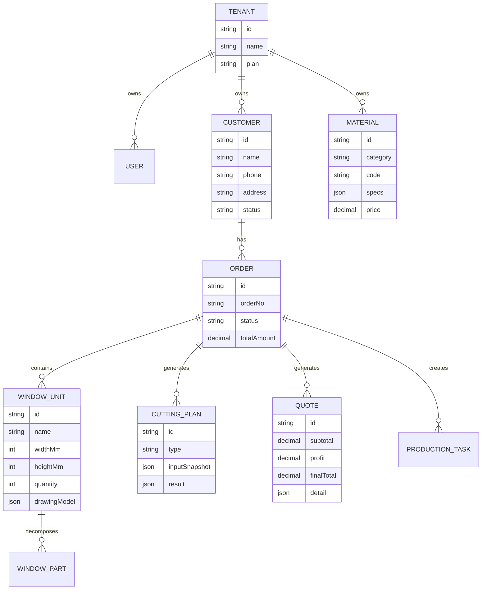
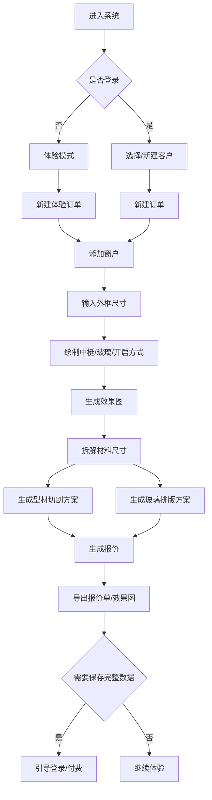
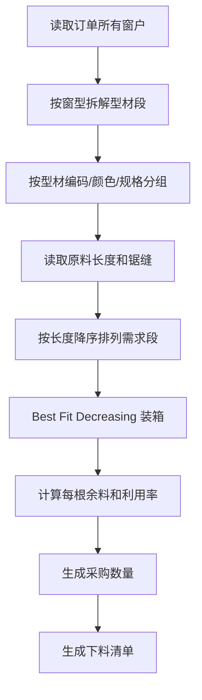
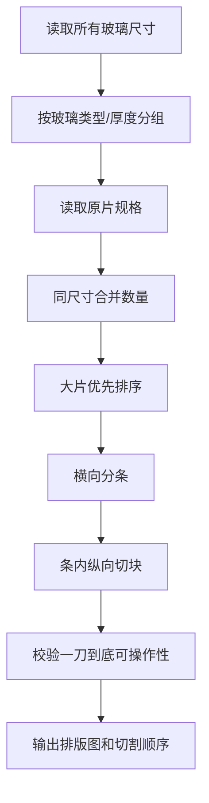
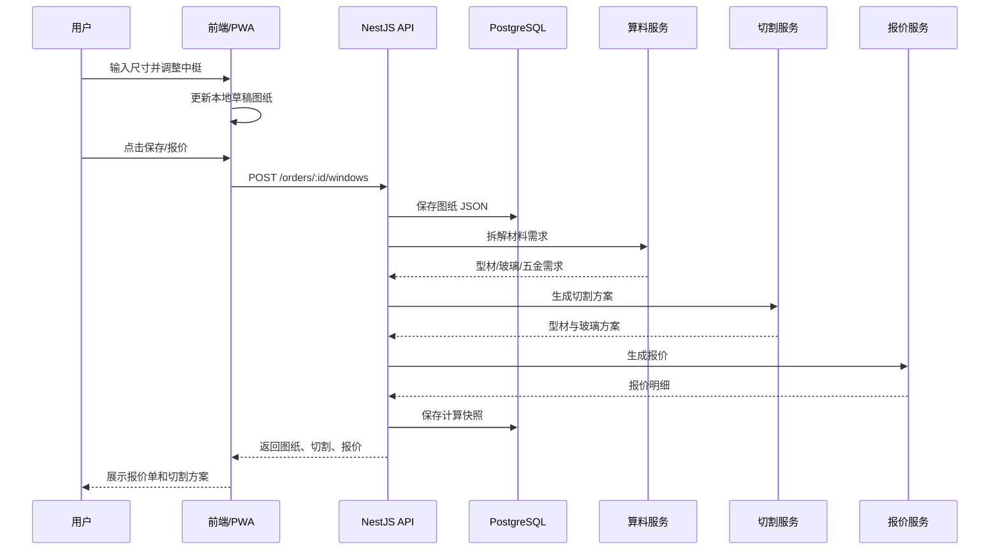
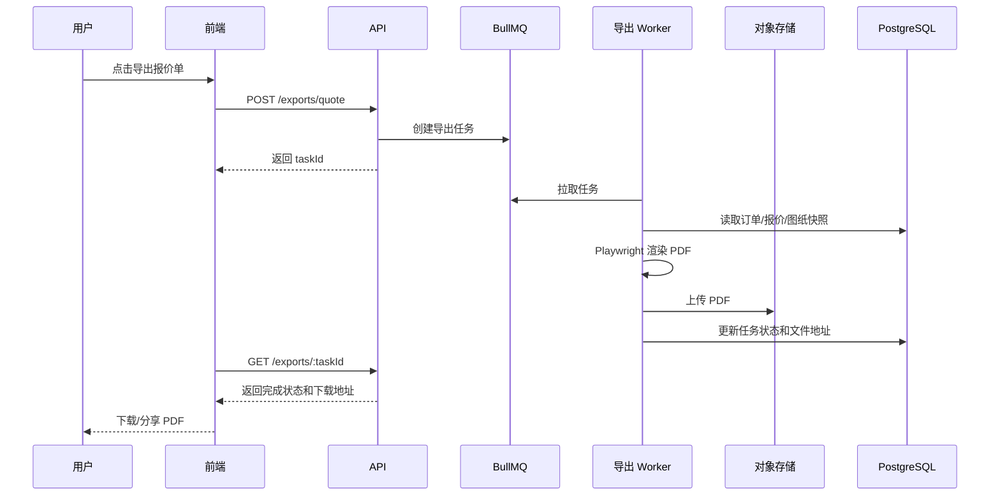
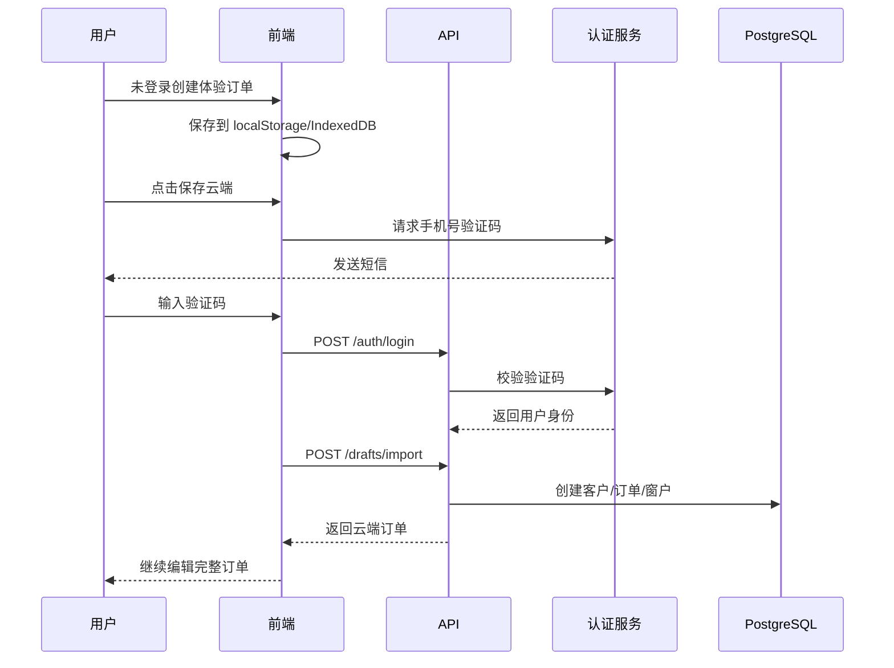
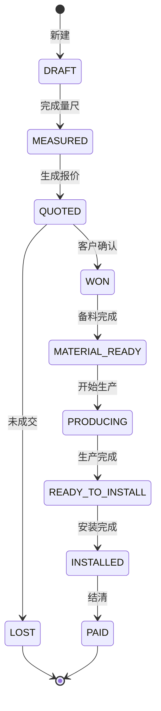
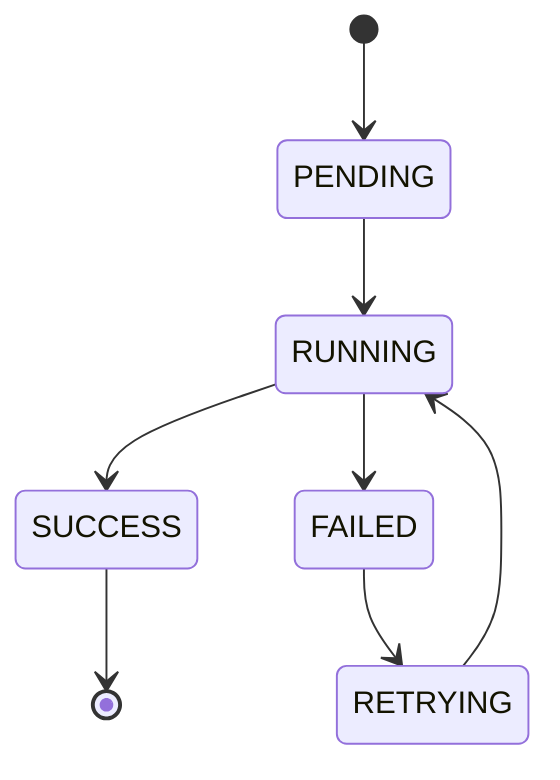

# WindoorOS 技术方案与架构设计

版本：v1.0  
日期：2026-05-27

## 1. 一句话

WindoorOS 是一个面向门窗小老板的 SaaS/PWA 系统，把现场量尺、参数化绘图、材料拆解、切割优化、报价和生产排单串成一条可追踪的数据链路。

## 2. 解决的问题

业务上解决：

- 现场量尺记录零散。
- 门窗效果无法快速展示给客户。
- 中梃、玻璃、型材尺寸容易漏算。
- 型材和玻璃采购靠经验，浪费不可控。
- 报价不透明且难复用。
- 客户订单和生产顺序缺少统一管理。

技术上解决：

- 手机与电脑同一套系统。
- 图形数据结构化存储，而不是只保存图片。
- 算料、切割、报价可复算、可追溯。
- 后续可商业化、多租户、权限控制。

## 3. 技术选型

## 3.1 总体形态

推荐采用：

- 前端：React + TypeScript + Vite
- 移动能力：PWA，后续可用 Capacitor 封装 App
- 画布：SVG + Canvas 混合
- 后端：NestJS + TypeScript
- 数据库：PostgreSQL
- ORM：Prisma
- 缓存/队列：Redis + BullMQ
- 文件存储：MinIO，生产可替换为阿里云 OSS/腾讯云 COS
- PDF 导出：Playwright 服务端渲染
- 部署：Docker Compose 起步，后续 Kubernetes

## 3.2 视觉与交互基线

产品主视觉采用“飞书式浅色企业工作台”，以清晰、可信、信息密度适中为核心。局部算法结果、生产状态、切割方案面板可借鉴 Linear 式专业数据面板的层级表达。

详细规范见 [DESIGN_DIRECTION.md](D:\WindoorOS\docs\DESIGN_DIRECTION.md)。

选择原因：

- 前后端都用 TypeScript，减少模型重复成本。
- SVG 适合尺寸标注、结构编辑、导出清晰图纸。
- Canvas 可用于复杂排版图或性能敏感渲染。
- PostgreSQL 适合结构化订单、JSON 图纸模型、审计记录。
- BullMQ 适合异步生成 PDF、复杂切割优化任务。

## 4. C4 Level 1：系统上下文

```mermaid
flowchart LR
  "门窗老板/员工" -->|"手机/电脑使用"| "WindoorOS"
  "客户" -->|"查看效果图/报价单"| "WindoorOS"
  "WindoorOS" -->|"短信验证码"| "短信服务"
  "WindoorOS" -->|"文件存储"| "对象存储"
  "WindoorOS" -->|"支付订阅，后续"| "支付平台"
  "WindoorOS" -->|"供应商价格，后续"| "材料供应商系统"
```

系统边界：

- WindoorOS 负责客户、订单、绘图、算料、报价、导出和权限。
- 短信、支付、对象存储、供应商价格属于外部依赖。

## 5. C4 Level 2：容器架构

```mermaid
flowchart TD
  "浏览器/PWA" -->|"HTTPS REST/WebSocket"| "API 网关/NestJS"
  "API 网关/NestJS" --> "认证模块"
  "API 网关/NestJS" --> "业务服务模块"
  "业务服务模块" --> "PostgreSQL"
  "业务服务模块" --> "Redis"
  "业务服务模块" --> "对象存储 MinIO/OSS"
  "业务服务模块" -->|"投递任务"| "BullMQ 队列"
  "BullMQ 队列" --> "算法 Worker"
  "BullMQ 队列" --> "导出 Worker"
  "算法 Worker" --> "PostgreSQL"
  "导出 Worker" --> "对象存储 MinIO/OSS"
```

容器说明：

- 浏览器/PWA：客户现场量尺、绘图、报价查看。
- API 网关/NestJS：统一鉴权、租户隔离、业务接口。
- PostgreSQL：核心业务数据。
- Redis：缓存、验证码、任务队列。
- Worker：复杂切割优化、PDF 导出、图片生成。
- 对象存储：照片、导出文件、报价单、图纸快照。

## 6. C4 Level 3：后端组件

```mermaid
flowchart TD
  "AuthModule 认证" --> "UserModule 用户/租户"
  "CustomerModule 客户" --> "OrderModule 订单"
  "OrderModule 订单" --> "WindowModule 门窗"
  "WindowModule 门窗" --> "DrawingModule 图纸模型"
  "WindowModule 门窗" --> "MaterialCalcModule 材料拆解"
  "MaterialCalcModule 材料拆解" --> "CuttingModule 切割优化"
  "MaterialCalcModule 材料拆解" --> "QuoteModule 报价"
  "MaterialModule 材料库" --> "MaterialCalcModule 材料拆解"
  "ExportModule 导出" --> "DrawingModule 图纸模型"
  "ExportModule 导出" --> "QuoteModule 报价"
  "ProductionModule 生产排单" --> "OrderModule 订单"
```

模块职责：

- AuthModule：登录、验证码、JWT、刷新令牌。
- UserModule：租户、员工、角色、权限。
- CustomerModule：客户资料、跟进记录。
- OrderModule：订单状态、金额、时间线。
- WindowModule：门窗单元、尺寸、窗型。
- DrawingModule：参数化图纸 JSON、SVG 生成。
- MaterialModule：型材、玻璃、五金、价格、规格。
- MaterialCalcModule：从门窗结构拆解材料需求。
- CuttingModule：型材一维切割、玻璃二维排版。
- QuoteModule：报价规则、成本、客户报价单。
- ExportModule：PNG/PDF/Excel 导出。
- ProductionModule：排单、生产状态。

## 7. 前端架构

```mermaid
flowchart TD
  "App Shell" --> "Auth Pages"
  "App Shell" --> "Customer Pages"
  "App Shell" --> "Order Workspace"
  "Order Workspace" --> "Window Canvas"
  "Order Workspace" --> "Dimension Editor"
  "Order Workspace" --> "Material Result Panel"
  "Order Workspace" --> "Quote Panel"
  "Window Canvas" --> "SVG Renderer"
  "Window Canvas" --> "Gesture Controller"
  "Dimension Editor" --> "Zustand/Redux Store"
  "API Client" --> "NestJS API"
```

前端状态分层：

- Server State：用户、客户、订单、材料库，使用 TanStack Query。
- Client Draft State：当前画布、未保存拖拽状态，使用 Zustand。
- Form State：客户表单、报价参数，使用 React Hook Form。

画布策略：

- 门窗主图使用 SVG。
- 标注、选区、中梃拖拽点用 SVG 元素。
- 导出 PNG 时将 SVG 序列化到 Canvas。
- 复杂玻璃排版图可用 Canvas 或 SVG。

## 8. 核心数据模型



## 9. 图纸 JSON 模型

门窗图纸不能只保存 SVG，必须保存可计算的结构化模型。

示例：

```json
{
  "version": 1,
  "unit": "mm",
  "outerFrame": {
    "width": 1800,
    "height": 1500,
    "profileCode": "ALU-70-FRAME"
  },
  "mullions": [
    {
      "id": "m1",
      "direction": "vertical",
      "x": 900,
      "fromY": 0,
      "toY": 1500,
      "profileCode": "ALU-70-MULLION"
    }
  ],
  "sashes": [
    {
      "id": "s1",
      "type": "sliding",
      "area": { "x": 0, "y": 0, "width": 900, "height": 1500 }
    }
  ],
  "glassPanels": [
    {
      "id": "g1",
      "width": 810,
      "height": 1380,
      "type": "5+12A+5"
    }
  ]
}
```

## 10. 核心业务流程

## 10.1 现场量尺到报价流程



## 10.2 型材切割流程



## 10.3 玻璃切割流程



## 11. 关键时序图

## 11.1 保存门窗并生成报价



## 11.2 导出报价单 PDF



## 11.3 未登录体验到登录保存



## 12. 数据流

```mermaid
flowchart LR
  "用户输入尺寸" --> "图纸 Draft Store"
  "图纸 Draft Store" --> "SVG 渲染"
  "图纸 Draft Store" --> "图纸 JSON"
  "图纸 JSON" --> "材料拆解"
  "材料拆解" --> "型材需求段"
  "材料拆解" --> "玻璃尺寸清单"
  "型材需求段" --> "一维切割优化"
  "玻璃尺寸清单" --> "二维玻璃排版"
  "一维切割优化" --> "切割方案快照"
  "二维玻璃排版" --> "切割方案快照"
  "切割方案快照" --> "报价计算"
  "报价计算" --> "报价单"
  "SVG 渲染" --> "效果图导出"
  "报价单" --> "PDF/图片导出"
```

## 13. 核心状态

## 13.1 订单状态



## 13.2 导出任务状态



## 14. API 设计

### 14.1 认证

```text
POST /api/auth/send-code
POST /api/auth/login
POST /api/auth/logout
POST /api/auth/refresh
GET  /api/auth/me
```

### 14.2 客户

```text
GET    /api/customers
POST   /api/customers
GET    /api/customers/:id
PATCH  /api/customers/:id
DELETE /api/customers/:id
```

### 14.3 订单

```text
GET    /api/orders
POST   /api/orders
GET    /api/orders/:id
PATCH  /api/orders/:id
POST   /api/orders/:id/status
```

### 14.4 门窗

```text
GET    /api/orders/:orderId/windows
POST   /api/orders/:orderId/windows
GET    /api/windows/:id
PATCH  /api/windows/:id
DELETE /api/windows/:id
POST   /api/windows/:id/duplicate
```

### 14.5 算料与切割

```text
POST /api/orders/:orderId/calculate-materials
POST /api/orders/:orderId/cutting/profile
POST /api/orders/:orderId/cutting/glass
GET  /api/orders/:orderId/cutting-plans
```

### 14.6 报价与导出

```text
POST /api/orders/:orderId/quotes
GET  /api/orders/:orderId/quotes/latest
POST /api/exports/quote
POST /api/exports/cutting-plan
GET  /api/exports/:taskId
```

## 15. 算法设计

## 15.1 型材一维切割

输入：

```ts
type ProfileCutInput = {
  stockLengths: number[];
  kerfMm: number;
  cuts: Array<{
    materialCode: string;
    lengthMm: number;
    quantity: number;
  }>;
};
```

输出：

```ts
type ProfileCutResult = {
  materialCode: string;
  bars: Array<{
    stockLengthMm: number;
    cuts: number[];
    kerfTotalMm: number;
    wasteMm: number;
  }>;
  efficiency: number;
  purchaseSummary: Array<{
    stockLengthMm: number;
    count: number;
  }>;
};
```

MVP 算法：

1. 按材料编码分组。
2. 将需求段展开为单根长度。
3. 按长度从大到小排序。
4. 对每段尝试放入已开原料中，选择放入后余料最小的一根。
5. 放不下则打开一根最合适的原料。
6. 每次同一根原料新增切割段时扣除锯缝。

## 15.2 玻璃二维排版

输入：

```ts
type GlassCutInput = {
  sheetSizes: Array<{ widthMm: number; heightMm: number }>;
  allowRotate: boolean;
  guillotineOnly: boolean;
  pieces: Array<{
    glassType: string;
    widthMm: number;
    heightMm: number;
    quantity: number;
  }>;
};
```

MVP 策略：

1. 按玻璃类型分组。
2. 同尺寸合并数量。
3. 按面积从大到小排序。
4. 在原片上先排横向条带。
5. 每条带内纵向切块。
6. 保证每条带可由贯通切割产生。

增强策略：

- Guillotine cutting 动态规划。
- 多规格原片择优。
- 允许旋转时双向评估。
- 余料入库。

## 16. 部署架构

```mermaid
flowchart TD
  "Nginx" --> "Frontend Static"
  "Nginx" --> "Backend API"
  "Backend API" --> "PostgreSQL"
  "Backend API" --> "Redis"
  "Backend API" --> "MinIO"
  "Backend API" --> "Worker"
  "Worker" --> "Redis"
  "Worker" --> "PostgreSQL"
  "Worker" --> "MinIO"
```

开发环境：

- Docker Compose 启动 PostgreSQL、Redis、MinIO。
- 前端本地 Vite。
- 后端本地 NestJS。

生产环境起步：

- 单机 Docker Compose。
- Nginx 反向代理。
- 数据库每日备份。

生产增强：

- Kubernetes。
- 托管 PostgreSQL。
- 对象存储云服务。
- CDN。
- 多副本 Worker。

## 17. 国内镜像源强制规范

本项目所有依赖安装、镜像构建和容器基础包安装必须使用国内镜像源。禁止在 CI、Dockerfile、README、脚本中直接使用默认国外源。

### 17.1 npm/pnpm/yarn

统一使用 npmmirror：

```ini
registry=https://registry.npmmirror.com
sass_binary_site=https://npmmirror.com/mirrors/node-sass/
sharp_binary_host=https://npmmirror.com/mirrors/sharp
sharp_libvips_binary_host=https://npmmirror.com/mirrors/sharp-libvips
electron_mirror=https://npmmirror.com/mirrors/electron/
playwright_download_host=https://npmmirror.com/mirrors/playwright/
```

项目必须提交：

```text
.npmrc
.yarnrc.yml，若使用 Yarn
```

推荐使用 pnpm：

```bash
corepack enable
pnpm config set registry https://registry.npmmirror.com
```

### 17.2 Docker

Docker daemon 必须配置国内 registry mirror。

示例 `/etc/docker/daemon.json`：

```json
{
  "registry-mirrors": [
    "https://docker.m.daocloud.io",
    "https://dockerproxy.com"
  ]
}
```

说明：

- Docker Hub 国内镜像可用性会变化，生产环境必须把镜像源配置做成环境变量或运维配置。
- 企业部署建议使用自建 Harbor 镜像仓库缓存基础镜像。
- Dockerfile 中基础镜像必须固定版本，禁止 `latest`。

### 17.3 Debian/Ubuntu apt

Dockerfile 内安装系统包必须替换 apt 源。

Debian 示例：

```dockerfile
RUN sed -i 's/deb.debian.org/mirrors.tuna.tsinghua.edu.cn/g' /etc/apt/sources.list.d/debian.sources \
  && sed -i 's/security.debian.org/mirrors.tuna.tsinghua.edu.cn/g' /etc/apt/sources.list.d/debian.sources
```

Ubuntu 示例：

```dockerfile
RUN sed -i 's/archive.ubuntu.com/mirrors.aliyun.com/g' /etc/apt/sources.list \
  && sed -i 's/security.ubuntu.com/mirrors.aliyun.com/g' /etc/apt/sources.list
```

### 17.4 Alpine apk

```dockerfile
RUN sed -i 's/dl-cdn.alpinelinux.org/mirrors.aliyun.com/g' /etc/apk/repositories
```

### 17.5 Python pip

若后续算法服务使用 Python，必须使用国内源。

项目提交 `pip.conf`：

```ini
[global]
index-url = https://pypi.tuna.tsinghua.edu.cn/simple
trusted-host = pypi.tuna.tsinghua.edu.cn
timeout = 120
```

### 17.6 Maven/Gradle

若后续 Android 或 Java 服务使用 Maven/Gradle，必须使用阿里云 Maven 镜像。

Gradle 示例：

```kotlin
repositories {
    maven { url = uri("https://maven.aliyun.com/repository/public") }
    maven { url = uri("https://maven.aliyun.com/repository/google") }
    maven { url = uri("https://maven.aliyun.com/repository/gradle-plugin") }
}
```

### 17.7 Playwright

PDF 导出或浏览器测试依赖 Playwright 时：

```bash
PLAYWRIGHT_DOWNLOAD_HOST=https://npmmirror.com/mirrors/playwright/ pnpm exec playwright install
```

### 17.8 CI 要求

CI 必须在第一步打印并校验：

```bash
npm config get registry
pnpm config get registry
```

若 registry 不是国内源，CI 直接失败。

Docker 构建必须：

- 使用国内基础镜像缓存。
- 构建参数传入镜像源。
- 不允许在构建过程中访问默认 npm、pypi、apt 国外源。

## 18. 推荐目录结构

```text
windooros/
  apps/
    web/
      src/
        pages/
        features/
          auth/
          customers/
          orders/
          drawing/
          cutting/
          quote/
        shared/
    api/
      src/
        modules/
          auth/
          users/
          customers/
          orders/
          windows/
          materials/
          cutting/
          quote/
          export/
        prisma/
    worker/
      src/
        cutting/
        export/
  packages/
    domain/
      src/
        drawing-model.ts
        material-rules.ts
        quote-types.ts
    algorithms/
      src/
        profile-cutting.ts
        glass-guillotine.ts
    ui/
  infra/
    docker/
    nginx/
    compose.yaml
  docs/
```

## 19. 工程质量要求

### 19.1 测试

必须覆盖：

- 图纸模型校验
- 型材拆解
- 型材切割算法
- 玻璃排版算法
- 报价计算
- 权限鉴权

测试类型：

- 单元测试：Vitest/Jest
- API 测试：Supertest
- E2E：Playwright
- 算法快照测试

### 19.2 日志

必须记录：

- 用户登录
- 订单状态变更
- 报价生成
- 切割方案生成参数
- 导出任务状态
- 关键错误

### 19.3 审计

报价和切割方案必须保存输入快照，避免材料价格或扣尺规则变更后无法追溯历史结果。

## 20. 风险与应对

### 20.1 行业扣尺规则复杂

风险：

- 不同型材系列、不同师傅习惯不一致。

应对：

- 扣尺规则配置化。
- MVP 先支持常见规则。
- 允许手动调整最终尺寸。

### 20.2 切割优化数学最优但师傅不好切

风险：

- 用户不接受过度复杂方案。

应对：

- 输出“省料优先”和“好切优先”两种模式。
- MVP 默认好切优先。

### 20.3 玻璃排版复杂

风险：

- 二维排样难度高，且有操作约束。

应对：

- MVP 做贯通切割策略。
- 后续引入更强算法。

### 20.4 手机画布难操作

风险：

- 手指拖动不精确。

应对：

- 拖拽只是辅助，最终尺寸输入为准。
- 提供放大、吸附、数字微调。

## 21. 代码阅读顺序

项目实现后建议按以下顺序读：

1. `packages/domain`
   - 先看图纸、材料、报价的核心类型。

2. `packages/algorithms`
   - 看型材切割和玻璃排版算法。

3. `apps/api/src/modules/windows`
   - 看门窗单元如何保存和校验。

4. `apps/api/src/modules/materials`
   - 看材料库和扣尺规则。

5. `apps/api/src/modules/cutting`
   - 看切割方案生成。

6. `apps/web/src/features/drawing`
   - 看画布如何把图纸 JSON 渲染成 SVG。

7. `apps/web/src/features/quote`
   - 看报价单展示和导出。

## 22. 参考镜像源

- npm 国内镜像：`https://registry.npmmirror.com`
- pip 清华镜像：`https://pypi.tuna.tsinghua.edu.cn/simple`
- Debian/Ubuntu 清华镜像：`https://mirrors.tuna.tsinghua.edu.cn`
- 阿里云镜像：`https://mirrors.aliyun.com`
- 阿里云 Maven：`https://maven.aliyun.com`

实际落地时，所有镜像源地址必须在 CI 和 Docker 构建阶段做可用性检查。
